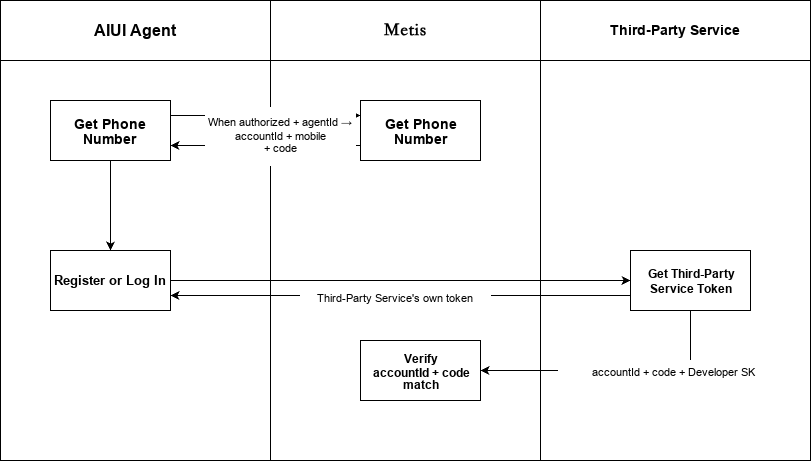
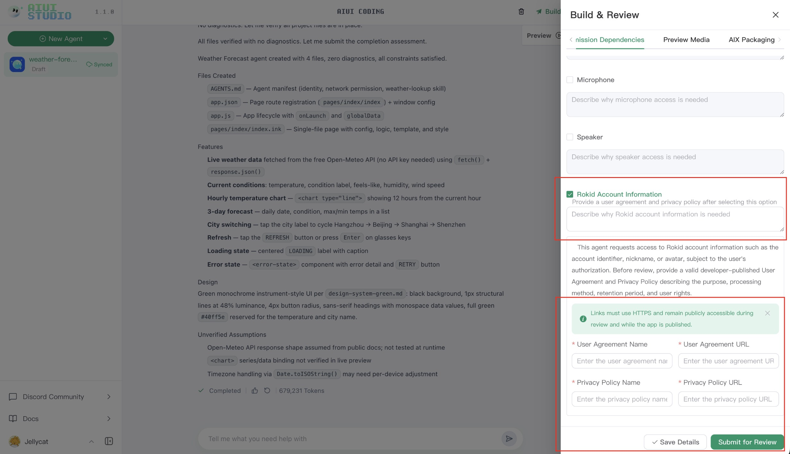
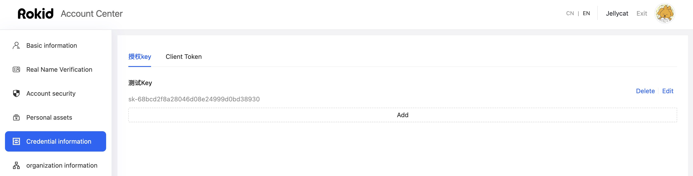

# AIUI Account Information Authorization and Verification

AIUI agents can read basic information for the current Rokid account and pass the user's identity to a developer server through a one-time verification code. Developer permission declarations and user authorization must be completed before calling the APIs; otherwise, restricted fields such as the mobile number and account verification code may be empty or unavailable.

> **Both parts of the authorization flow are required:** developers must select the “Rokid Account Information” permission in AIUI Studio and save the usage details; users must complete authorization under “Third-Party Service Authorization” in the Rokid AI App. API calls cannot replace either step.



## 1. Authorization and API Call Flow

```text
Developer selects the “Rokid Account Information” permission in AIUI Studio
                                        ↓
Developer provides the usage, user agreement, and privacy policy, then saves the details
                                        ↓
User completes authorization under “Third-Party Service Authorization” in the Rokid AI App
                                        ↓
Agent calls checkUserAuth() to check the authorization status
                                        ↓
Agent calls getProfile() to obtain basic account information and a one-time verification code
                                        ↓
Developer server optionally calls checkAccountCode to verify the account and agent ownership
```

| Role | Action | Result |
| --- | --- | --- |
| Developer | Declare the “Rokid Account Information” permission in AIUI Studio | The platform understands why the agent needs account information |
| User | Complete third-party service authorization in the Rokid AI App | The developer's agent can read restricted account fields |
| Agent | Check authorization and obtain account information | Available account fields and authorization prompts are returned |
| Developer server | Optionally verify `accountId` and `code` | The user's identity and agent ownership are confirmed |

## 2. Developer Permission Configuration

1. Open the agent that needs account information in AIUI Studio.
2. In the right-side “Build and Submit for Review” panel, select “Permission Dependencies”.
3. Select “Rokid Account Information” and provide the specific usage.
4. Add the user agreement and privacy policy, then save the details.
5. For an already-built agent, generate and deploy a new version so the updated permission configuration takes effect.



The declared usage must match the agent's behavior. Request and process only the information required by the business. If the permission is not selected, the details are not saved, or the privacy materials are incomplete, the user authorization flow may not be established correctly.

## 3. User Third-Party Service Authorization

1. Sign in to the Rokid AI App with the same Rokid account used with the glasses.
2. On the home page, tap “Third-Party Service Authorization” in the “Recommended Settings” area.
3. On the authorization page, find the relevant developer or service, select the required permissions, read the authorization details, and confirm.
4. Return to the agent and trigger the account-information feature again.

When the user has not authorized, has revoked authorization, or the authorization relationship is no longer valid, the agent may still receive some non-sensitive information, but restricted fields such as `mobile` and `code` may be empty. Use `notification` to guide the user through authorization when it is non-empty.

## 4. Agent Authorization Check and Account Information Retrieval

### 4.1 Check the User's Authorization Status

Call `checkUserAuth()` to check whether the current user has completed authorization. Use the result for logging, UI prompts, and troubleshooting; do not treat it as a hard gate for subsequent API calls. Even if the check fails, you can still call `getProfile()` to obtain currently available non-sensitive fields.

```typescript
import { createOpenAPI } from 'open';

const api = await createOpenAPI();
const authResult = await api.auth.checkUserAuth();

if (!authResult?.data?.checkResult) {
  console.warn(authResult?.data?.msg || 'The user has not completed account authorization');
}
```

Example response when the user is not authorized:

```json
{
  "code": 1,
  "msg": "success",
  "timestamp": 1762760038068,
  "uuid": "trace-id",
  "data": {
    "checkResult": false,
    "msg": "The user has not signed an agreement with the developer"
  }
}
```

### 4.2 Get Basic AIUI Account Information

Get basic information for the currently signed-in user and generate an account verification code valid for five minutes.

#### Request

Call this from the AIUI agent code:

```typescript
import { createOpenAPI } from 'open';

const api = await createOpenAPI();
const profile = await api.account.getProfile();
```

#### Response Parameters

This API directly returns an account information object.

| Parameter | Type | Description |
| --- | --- | --- |
| `accountId` | `string` | The current user's account ID |
| `headIcon` | `string` | User avatar URL; may be empty when no avatar is set |
| `userName` | `string` | User nickname |
| `mobile` | `string` | User mobile number; may be empty when the user has not authorized or has no bound mobile number |
| `code` | `string` | One-time account verification code, valid for five minutes; may be empty without authorization |
| `notification` | `string` | Authorization prompt to show to the user; may be empty when no prompt is needed |

#### Successful Response Example

```json
{
  "accountId": "123456789",
  "headIcon": "https://example.com/avatar.png",
  "userName": "Zhang San",
  "mobile": "138****8888",
  "code": "6d9b691ec18a4690bd43cf53df4d49d2",
  "notification": null
}
```

#### Unauthorized Prompt Example

When the agent requires authorization but the current user has not completed it, `notification` contains a prompt:

```json
{
  "accountId": "123456789",
  "headIcon": "https://example.com/avatar.png",
  "userName": "Zhang San",
  "mobile": null,
  "code": null,
  "notification": "To use this feature, go to Rokid AI App - Home - Third-Party Service Authorization to authorize the account"
}
```

When `notification` is non-empty, show or relay it to the user. Do not assume that restricted fields are present.

#### Notes

1. Each request generates a new account verification code.
2. The account verification code is valid for five minutes.
3. The code is bound to the current account and the corresponding agent.
4. If the developer server needs to confirm the user's identity, submit the returned `accountId` and `code` to the account verification API.

---

## 5. Verify the Account Code on the Developer Server

When the developer server needs to establish a trusted account session, call this API to check whether the account verification code is valid and verify that the agent that generated it belongs to the specified developer. This step can be skipped when the agent only displays basic account information.

> `developerSk` is a developer credential. Store it only on the server; never include it in AIUI agent code, client packages, or frontend logs.
>
> Obtain this SK by adding one under Rokid Account Center - Credential Information.



### Request Information

- **Endpoint**: `https://rcs.rokid.com/metis/openApi/v1/checkAccountCode`
- **Method**: `POST`
- **Content-Type**: `application/json`

> When accessing the Metis service directly without the gateway, use `/openApi/v1/checkAccountCode`.

### Request Headers

No business headers are required other than `Content-Type: application/json`.

### Request Body

| Parameter | Type | Required | Description |
| --- | --- | --- | --- |
| `accountId` | String | Yes | Account ID returned by the `/profile` API |
| `code` | String | Yes | Account verification code returned by the `/profile` API |
| `developerSk` | String | Yes | Developer SK used to verify agent ownership; obtain it from the developer account center |

### Request Example

```bash
curl --location --request POST 'https://rcs.rokid.com/metis/openApi/v1/checkAccountCode' \\
  --header 'Content-Type: application/json' \\
  --data-raw '{
    "accountId": "123456789",
    "code": "6d9b691ec18a4690bd43cf53df4d49d2",
    "developerSk": "developer-sk"
  }'
```

### Response Parameters

#### Common Response Structure

| Parameter | Type | Description |
| --- | --- | --- |
| `code` | Integer | Business status code; `1` means the API call succeeded |
| `msg` | String | Response message |
| `timestamp` | Long | Response timestamp in milliseconds |
| `uuid` | String | Request trace ID |
| `data` | Object | Verification result |

#### `data` Parameters

| Parameter | Type | Description |
| --- | --- | --- |
| `checkResult` | Boolean | `true` means verification passed; `false` means it failed |
| `mobile` | String | User mobile number returned after successful verification |

### Successful Verification Response

```json
{
  "code": 1,
  "msg": "success",
  "timestamp": 1787760000000,
  "uuid": "trace-id",
  "data": {
    "checkResult": true,
    "mobile": "13888888888"
  }
}
```

### Failed Verification Response

```json
{
  "code": 1,
  "msg": "success",
  "timestamp": 1787760000000,
  "uuid": "trace-id",
  "data": {
    "checkResult": false
  }
}
```

### Verification Failure Conditions

Any of the following causes `checkResult = false`:

1. `accountId`, `code`, or `developerSk` is empty.
2. The account verification code does not exist or is older than five minutes.
3. The agent associated with the code does not exist or has been deleted.
4. `developerSk` is invalid.
5. The developer associated with `developerSk` is not the agent's creator.
6. An exception occurs while the account center verifies the developer SK.

### Notes

1. After successful verification, the account verification code is deleted immediately and cannot be reused.
2. After failed verification, the code is not deleted automatically; a correct `developerSk` can be submitted again while the code remains valid.
3. `checkResult = false` is a business verification failure; the common response `code` remains `1`.
4. Complete verification within five minutes after receiving the result from `getProfile()`.

## 6. Troubleshooting

| Symptom | Possible Cause | Resolution |
| --- | --- | --- |
| `checkUserAuth()` returns `false` | Permission not declared in AIUI Studio, or the user has not authorized | Check that “Rokid Account Information” is saved, then guide the user to authorize in the Rokid AI App |
| `notification` contains an authorization prompt | Authorization is incomplete, revoked, or expired | Show the prompt, complete authorization, and call the API again |
| `mobile` or `code` is empty | User not authorized, no bound mobile number, or permission configuration not yet effective | Check for null values and verify both developer configuration and user authorization |
| “User ticket expired” is returned | Rokid account sign-in state has expired | Guide the user to sign in to the Rokid AI App again or reopen the agent |
| `checkResult = false` | Code expired, `developerSk` is incorrect, or agent ownership does not match | Get a new code and verify the developer SK used by the server |
| The code cannot be reused | The code was successfully verified and deleted | Call `getProfile()` again to get a new code |

## 7. Data and Credential Security

- Request and process only business-required account information, and accurately describe its usage in the user agreement and privacy policy.
- Store `developerSk` only in a developer-server environment variable or secret-management service.
- The account verification code is valid for five minutes and expires immediately after successful verification; do not cache or reuse it.
- Do not log full mobile numbers, account verification codes, developer SKs, or other sensitive information.
- Always check nullable fields such as `mobile`, `code`, and `notification` so an unauthorized state is not mistaken for an API failure.
